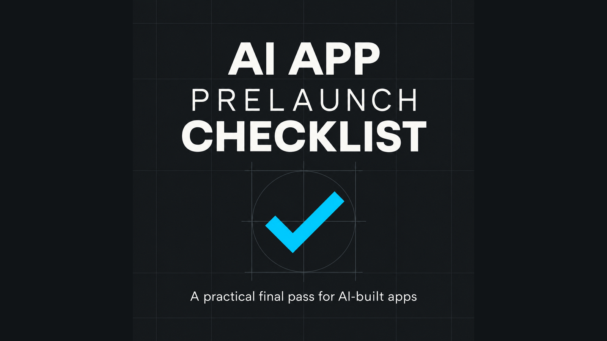

# AI App Prelaunch Starter Pack

A free prelaunch checklist and three complete agent skills for apps built with **Codex, Cursor, Claude Code, Windsurf, ChatGPT**, or another AI coding tool.

Use it when the demo works but you still need to prove the app survives a clean install, empty data, failed requests, and the exact release artifact a user will receive.

## Get a useful result in one minute

1. Open [`TRY-THIS-FIRST.md`](TRY-THIS-FIRST.md).
2. Copy its prompt into your coding agent.
3. Run it against the exact build or package you plan to ship.
4. Inspect the evidence before accepting the result.

The first exercise runs a clean-install check. It asks the agent to identify hidden developer state, test the real artifact from a clean environment, and return a pass, fail, or blocked result with evidence.

## What is included

| File | What it does |
| --- | --- |
| [`TRY-THIS-FIRST.md`](TRY-THIS-FIRST.md) | Runs a concrete clean-install exercise against your app. |
| [`AI-APP-PRELAUNCH-CHECKLIST.md`](AI-APP-PRELAUNCH-CHECKLIST.md) | Checks the core flow, failure states, privacy, packaging, and release decision. |
| [`SAFE-AI-CODING-RULES.txt`](SAFE-AI-CODING-RULES.txt) | Keeps an agent inside one milestone and requires observable evidence. |
| [`clean-install-verifier`](agent-skills/clean-install-verifier/SKILL.md) | Proves the packaged app works without hidden local setup. |
| [`bug-reproducer`](agent-skills/bug-reproducer/SKILL.md) | Turns a vague failure into repeatable steps and a bounded fix request. |
| [`go-no-go-coordinator`](agent-skills/go-no-go-coordinator/SKILL.md) | Converts current evidence into a ship, hold, or conditional decision. |

Each `SKILL.md` contains a trigger, required inputs, workflow, evidence gate, and output format. The files are plain Markdown and text, so they do not depend on a specific IDE or agent.

## The checks that catch the most problems

- Install the final artifact somewhere without your development setup or saved state.
- Start with a new account and no data.
- Interrupt the main action with an unavailable service or failed request, then retry.
- Verify authorization and payment results on the server side instead of trusting the success screen.
- Reopen the app and confirm promised work persists.
- Make the release decision from recorded checks and known blockers.

## Download the ZIP

The same files are available as a single free download on Gumroad:

[Download the free Starter Pack v1.3](https://haonv2.gumroad.com/l/ai-app-prelaunch-checklist?utm_source=github&utm_medium=repository&utm_campaign=v14_launch)

## Get the complete 24-skill workflow

The **Vibe Coding App Launch Kit — Builder Edition v1.4** adds 21 focused skills for scoping, acceptance criteria, failure recovery, privacy, authentication, payments, migrations, packaging, store review, support, and the final release decision.

It also includes native Cursor, Windsurf, and Claude Code rules; a guided brief generator; Notion and Obsidian workspaces; acceptance and bug workflows; and four worked examples.

[Get the Builder Edition with the launch offer applied](https://haonv2.gumroad.com/l/vibe-coding-app-launch-kit?offer_code=LAUNCH25&wanted=true&utm_source=github&utm_medium=repository&utm_campaign=v14_launch)

`LAUNCH25` gives the first 10 buyers 25% off.

## License and responsibility

You may use and modify the included files for your own personal or commercial app projects. See [`LICENSE.md`](LICENSE.md) for the full terms.

This pack helps structure requirements and evidence. It does not guarantee that generated software is correct, secure, compliant, or commercially successful. You remain responsible for reviewing the code, licenses, security, privacy, platform rules, and release decision.
